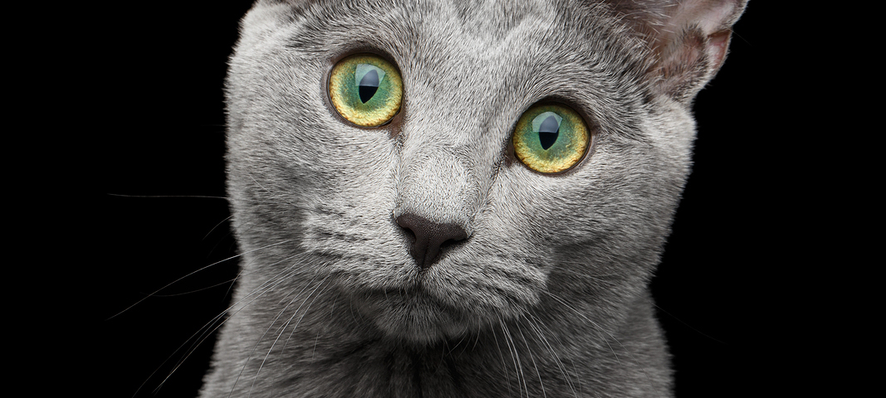

==== IMAGES

* Block
+
image::Images/cat_1.jpg[]
+
.Where is it looking ?
[#img-cat]
[caption="Cat 2: ",link=https://www.hillspet.com/cat-care/cat-breeds/russian-blue]

* Inline
+
Click image:Images/play.png[start,title="start"] for start
+
Click  for pause
