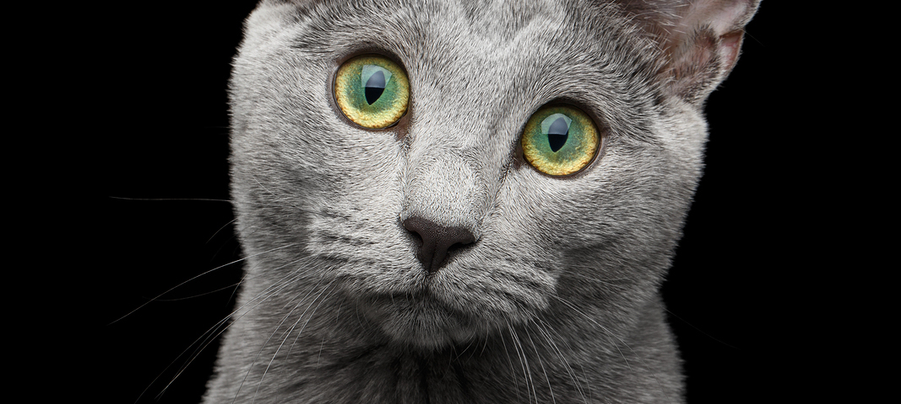

[#AnaBaslik]
= İki şey sonsuzdur; İnsanoğlunun aptallığı ve evren. Fakat ikincisinden emin değilim (Albert Einstein)

== Azim paha biçilmezdir, Çok zeki olduğumdan değil, sorunlarla uğraşmaktan vazgeçmediğimden başarıyorum(Albert Einstein)

***

====
LINUX

.  Linux, UNIX benzeri, açık kaynak kodlu bir işletim
sistemidir.

. Çoğunlukla Linux denilse de, daha doğrusu GNU/Linux
demektir. Çünkü, linux çekirdeğin adıdır, geri kalan
herşey GNU projesi ile başlamıştır.

. Linux'ta her dosya ya da dizin bir başka dizinin içinde
bulunmak zorundadır.

Linux dizin yapısı

* Ev dizinleri genelde /home dizini içinde yer alır.

* Pek çok komut /bin ve /sbin dizinindedir.

* Geçici dosyalar /tmp dizininde tutulur.

* Programlar genelde /usr ve /opt dizinlerinde tutulur.

* Sistemin ayar dosyaları /etc dizinindedir.

* Tüm donanımlar da bu ağaç yapısına bir dosya olarak
bağlanırlar (Genelde /dev dizininde).

====

[#Admonition]
====
IMPORTANT: This is important for you...

WARNING: This is warning for you...

NOTE: This is note for you... 

====

*** 

LINKS

* External

http://bilgisayar.kocaeli.edu.tr

http://bilgisayar.kocaeli.edu.tr[*KOÜ* - Bilgisayar Mühendisliği]

* With spaces and special characters

link:++https://example.org/?q=[a b]++[URL with special characters]

link:https://example.org/?q=%5Ba%20b%5D[URL with special characters]

* Relative

link:index.html[index]

* Link with attributes

:linkattrs:

http://discuss.asciidoctor.org[Discuss Asciidoctor, role="external", window="_blank"]

http://discuss.asciidoctor.org[Discuss Asciidoctor^]

https://example.org["Google, Yahoo, Bing^", role="teal"]

* Inline anchors
 
link:odev_01_eklenti.adoc[]

[[bookmark-a]]Inline anchors make arbitrary content referenceable.

[#bookmark-b]#Inline anchors can be applied to a phrase like this one.#

anchor:bookmark-c[]Use a cross reference to link to this location.

[[bookmark-d,last paragraph]]The xreflabel attribute will be used as link text in the cross-reference link.

* Internal cross

Go to main first title in page <<AnaBaslik,İlk başlık>>.

Go to admonitions in page <<Admonition,Admonitions>>

* Images

image::cat_1.jpg[]

.Where is it looking ?
[#img-cat]
[caption="Cat 2: ",link=https://www.hillspet.com/cat-care/cat-breeds/russian-blue]

